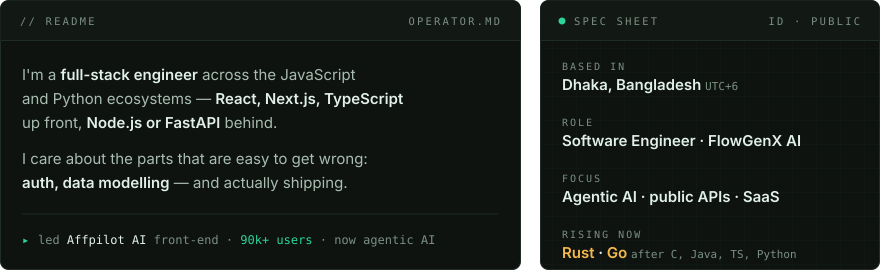
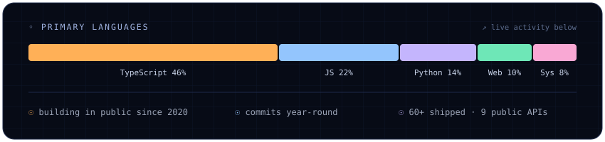
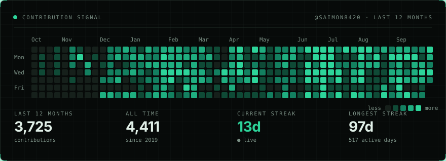

<!-- ▣ MISSION CONTROL — palette shared with the portfolio (my-portfolio-seven-delta-60.vercel.app) -->

## `01` Operator Profile &nbsp;`DOSSIER`

## `02` Backend APIs &nbsp;`10 FREE · NO-KEY PUBLIC APIS`

> Pure-computation REST engines — no data feeds, no tracking, documented with OpenAPI, deployed on Vercel.

| API | Reads | Built with | |
| :-- | :-- | :-- | :-: |
| **Miqaat** | Prayer times, fasting, Hijri calendar, Qibla | `TS · adhan · hijri-converter` | [live ↗](https://miqaat-dev.vercel.app) |
| **Horizon** | Sun & Moon — sunrise/set, twilight, phases, golden hour | `TS · Express · SunCalc` | [live ↗](https://horizon-prod-lk.vercel.app) |
| **Orrery** | Astronomy — positions, eclipses, seasons, conjunctions | `TS · astronomy-engine` | [live ↗](https://orrery-dev.vercel.app) |
| **Astraea** | Astrology — natal charts, houses, aspects, transits | `TS · astronomy-engine` | [live ↗](https://astraea-dev.vercel.app) |
| **Rave** | Human Design — full BodyGraph from birth data | `TS · astronomy-engine` | [live ↗](https://rave-swart.vercel.app) |
| **Vitals** | Clinical calculators — eGFR, ASCVD, BMI/BSA, GCS, dosing | `TS · Express · zod` | [live ↗](https://vitals-dev.vercel.app) |
| **Verdant** | Carbon footprint — driving, flights, grid, diet, freight | `TS · Express · zod` | [live ↗](https://verdant-dev-gamma.vercel.app) |
| **Tessera** | Geospatial geometry — distance, area, overlay, hulls | `TS · Turf.js` | [live ↗](https://tessera-zeta-dev.vercel.app) |
| **Swelter** | Thermal comfort — Heat Index, WBGT, UTCI, wind chill | `TS · Express` | [live ↗](https://swelter-dev.vercel.app) |
| **Declino** | Geomagnetic field — declination, drift, true↔magnetic | `TS · geomagnetism` | [live ↗](https://declino.vercel.app) |

## `03` The Fleet &nbsp;`60+ SHIPPED`

> A few of the 60+ live products I've shipped — clients, studios, and in-browser AI tools.

| App | What it is | Built with | |
| :-- | :-- | :-- | :-: |
| **Parallax** | Your sky, right now — live Sun/Moon radar & orrery, EN/বাংলা | `Vite · React · TS` | [live ↗](https://parallax-dev567.vercel.app) |
| **Doetra** | AI SEO article-generator SaaS — built solo, end to end | `Next · Node · Stripe` | [live ↗](https://app.doetra.com) |
| **Awqat** | Prayer & fasting timetable studio — cards/posters, EN/BN/AR | `React · Vite` | [live ↗](https://awqat-dev.vercel.app) |
| **Vanish** | In-browser AI object eraser — paint over, AI inpaints it away | `React · ONNX · LaMa` | [live ↗](https://vanish-bice.vercel.app) |
| **Quill** | In-browser PDF editor — fill, sign, redact, merge | `React · pdf-lib` | [live ↗](https://quill-rho-mauve.vercel.app) |
| **Capsy** | Video auto-captioner — Whisper transcribes & burns subtitles | `React · Whisper` | [live ↗](https://capsy-two.vercel.app) |

## `04` Rising Now &nbsp;`CURRENT FOCUS`

Building agentic-AI integrations at **FlowGenX AI**, and leveling up systems languages.

## `05` Systems Stack &nbsp;`TECH I BUILD WITH`

**▸ Languages**

**▸ Frontend**

**▸ UI kits**

**▸ Backend & Auth**

**▸ Databases & ORMs**

**▸ DevOps, Cloud & Tooling**

## `06` Source Activity &nbsp;`@SAIMON8420`

  

## `07` Uplink &nbsp;`CHANNELS OPEN`

 

